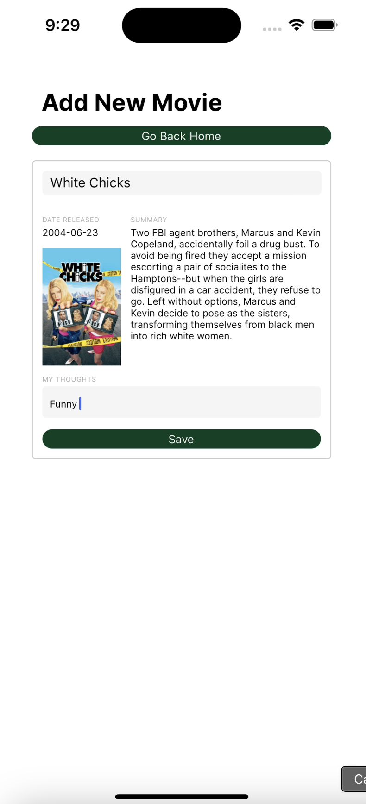
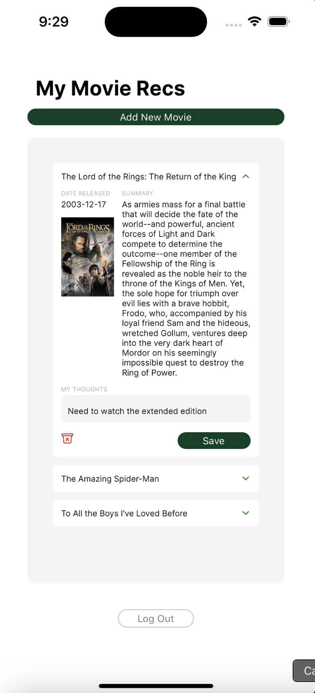

# 🎥 Movie Recommendations App

An intuitive React Native app for managing personalized movie recommendations. Built with Firebase, Redux, and TypeScript, this app allows users to add, update, and delete movies from their collection, save thoughts, and explore new recommendations.

---

## 📖 Table of Contents
- [Features](#features)
- [Technologies Used](#technologies-used)
- [Setup and Installation](#setup-and-installation)
- [Usage](#usage)
- [Screenshots](#screenshots)
- [Project Structure](#project-structure)
- [Contributing](#contributing)
- [License](#license)

---

## 🚀 Features
- User authentication (sign up, log in, log out) using Firebase.
- Add movies to a personalized collection with data fetched from The Movie Database (TMDb) API.
- Save personal thoughts and ratings for each movie.
- Update or delete movies from the collection.
- Redux-powered state management for efficient performance.
- Dynamic UI animations for a smooth user experience.

---

## 🛠 Technologies Used
- **React Native**: Cross-platform app development.
- **TypeScript**: For type-safe code and better developer experience.
- **Redux Toolkit**: State management for seamless data flow.
- **Firebase**: 
  - Firestore for user-specific movie storage.
  - Authentication for secure user access.
- **TMDb API**: Fetch movie data such as title, release date, overview, and poster.
- **Expo**: Streamlined development, building, and deployment.

---

## 🖥 Setup and Installation

1. **Clone the Repository**:
   ```bash
   git clone https://github.com/your-username/movie-recommendations-app.git
   cd movie-recommendations-app
   ```

2. **Install Dependencies**:
   ```bash
   npm install
   ```

3. **Configure Firebase**:
   - Set up a Firebase project at [Firebase Console](https://console.firebase.google.com/).
   - Enable Firestore and Authentication (Email/Password).
   - Copy your Firebase config object into `FirebaseConfig.ts`.

4. **Add TMDb API Key**:
   - Create an account at [TMDb](https://www.themoviedb.org/).
   - Get your API key and replace the placeholder in `services/tmdb.js`.

5. **Start the Development Server**:
   ```bash
   npm start
   ```

---

## 📲 Usage

### Adding a Movie:
1. Search for a movie using the **Add New Movie** screen.
2. Select a movie from the search results.
3. Save personal thoughts and add it to your collection.

### Viewing and Managing Movies:
1. View your collection on the **Home** screen.
2. Expand any movie to update your thoughts or delete it from the collection.

### Authentication:
- Log in to access your personalized collection.
- Sign up if you're a new user.

---

## 📸 Screenshots
<table>
  <tr>
    <td>Add New Movie Screen</td>
     <td>Home Screen</td>
  </tr>
  <tr>
    <td></td>
    <td></td>
  </tr>
 </table>
 
---

## 📁 Project Structure
```
movie-recommendations-app/
├── components/         # Reusable React components
│   ├── MovieDetails.tsx
├── services/           # API services (TMDb)
│   └── tmdb.js
├── redux/              # Redux slices and store
│   ├── moviesSlice.ts
│   ├── store.ts
├── screens/            # Screen components
│   ├── Home.tsx
│   ├── AddNewMovie.tsx
│   ├── LogIn.tsx
│   ├── SignUp.tsx
├── styles/             # Global and component-specific styles
│   └── styles.ts
├── FirebaseConfig.ts   # Firebase setup and config
├── App.tsx             # Main app entry
└── package.json        # Project metadata and dependencies
```

---

## 🤝 Contributing
Contributions are welcome! Here's how you can contribute:
1. Fork the repository.
2. Create a feature branch (`git checkout -b feature/your-feature`).
3. Commit your changes (`git commit -m 'Add some feature'`).
4. Push to the branch (`git push origin feature/your-feature`).
5. Open a pull request.

---

## 📝 License
This project is licensed under the MIT License. See the [LICENSE](LICENSE) file for details.

---

## ✨ Acknowledgements
- Thanks to [TMDb](https://www.themoviedb.org/) for the API.
- Special thanks to Firebase for making authentication and database management easy.

---

Feel free to customize this further to include personal notes, links, or additional sections!
